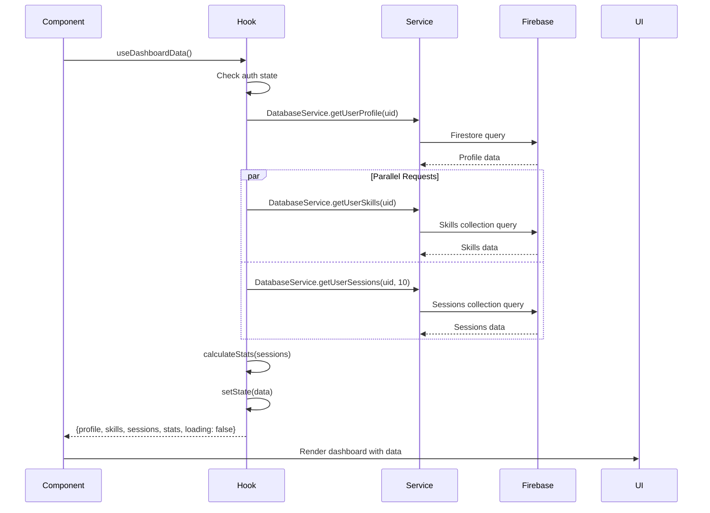
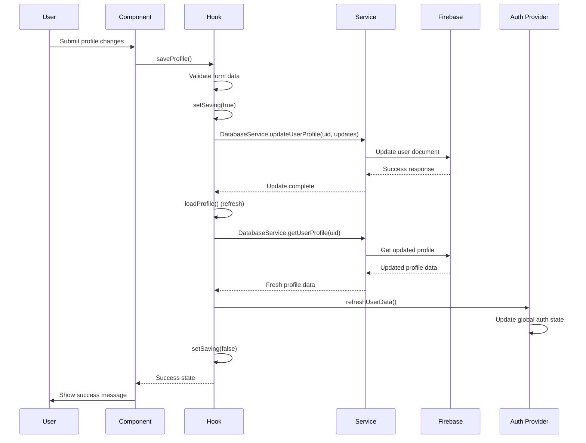
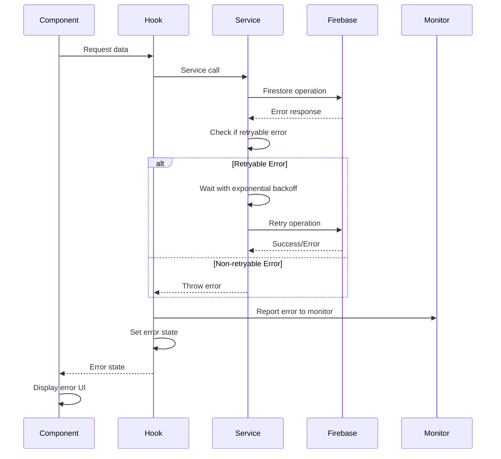

# Data Flow Architecture

## Overview

Grant Guide implements a unidirectional data flow architecture that ensures predictable state management, efficient data fetching, and seamless user experience. The system follows React best practices with custom hooks for data management, Firebase for backend operations, and integrated job market data flows.

## Data Flow Patterns

### 1. **Component → Hook → Service → Database → Response**

```
┌─────────────┐    ┌──────────────┐    ┌─────────────┐    ┌──────────────┐
│  Component  │───▶│ Custom Hook  │───▶│   Service   │───▶│   Firebase   │
│             │    │              │    │             │    │   Firestore  │
│ Dashboard   │    │useDashboard  │    │ Database    │    │              │
│ Profile     │    │useProfile    │    │ Service     │    │              │
│ Auth        │    │useAuth       │    │ Auth        │    │              │
└─────────────┘    └──────────────┘    └─────────────┘    └──────────────┘
       ▲                   ▲                   ▲                   │
       │                   │                   │                   │
       │            ╔══════▼═══════╗    ╔══════▼═══════╗          │
       │            ║ State Update ║    ║ Error        ║          │
       └────────────║ Loading      ║    ║ Handling     ║◀─────────┘
                    ║ Management   ║    ║ Retry Logic  ║
                    ╚══════════════╝    ╚══════════════╝
```

## Core Data Flow Components

### 1. Custom Hooks Layer

**Purpose**: Abstract data fetching logic and provide reactive state management

#### useDashboardData Hook
```typescript
export const useDashboardData = (): DashboardData => {
  const { user } = useAuth();
  const [data, setData] = useState<DashboardData>({
    profile: null,
    skills: [],
    recentSessions: [],
    stats: calculateDefaultStats(),
    loading: true,
    error: null,
  });

  useEffect(() => {
    if (!user?.uid) {
      setData(prev => ({ ...prev, loading: false }));
      return;
    }

    const fetchDashboardData = async () => {
      try {
        setData(prev => ({ ...prev, loading: true, error: null }));

        // Parallel data fetching for optimal performance
        const [profile, skills, sessions] = await Promise.all([
          DatabaseService.getUserProfile(user.uid),
          DatabaseService.getUserSkills(user.uid),
          DatabaseService.getUserSessions(user.uid, 10),
        ]);

        const stats = calculateStats(sessions);

        setData({
          profile,
          skills,
          recentSessions: sessions,
          stats,
          loading: false,
          error: null,
        });
      } catch (error) {
        console.error("Error fetching dashboard data:", error);
        setData(prev => ({
          ...prev,
          loading: false,
          error: error instanceof Error ? error.message : "Failed to load dashboard data",
        }));
      }
    };

    fetchDashboardData();
  }, [user?.uid]);

  return data;
};
```

#### useProfile Hook
```typescript
export const useProfile = () => {
  const { user, refreshUserData } = useAuth();
  const [profile, setProfile] = useState<UserProfile | null>(null);
  const [loading, setLoading] = useState(true);
  const [error, setError] = useState<string | null>(null);

  // Load profile with useCallback to prevent re-render loops
  const loadProfile = useCallback(async () => {
    if (!user?.uid) return;

    try {
      setLoading(true);
      setError(null);

      const userProfile = await DatabaseService.getUserProfile(user.uid);
      if (userProfile) {
        setProfile(userProfile);
        // Update form data for editing
        setEditData(mapProfileToFormData(userProfile));
      }
    } catch (error) {
      console.error("Error loading profile:", error);
      setError("Failed to load profile data");
    } finally {
      setLoading(false);
    }
  }, [user?.uid]);

  // Save profile changes
  const saveProfile = async () => {
    if (!user?.uid || !profile) return;

    try {
      setSaving(true);
      setError(null);

      const updates = mapFormDataToProfile(editData);
      await DatabaseService.updateUserProfile(user.uid, updates);

      // Refresh local data
      await loadProfile();
      await refreshUserData();

      setIsEditing(false);
    } catch (error) {
      console.error("Error saving profile:", error);
      setError("Failed to save profile changes");
    } finally {
      setSaving(false);
    }
  };

  return {
    profile,
    loading,
    error,
    loadProfile,
    saveProfile,
    // ... other profile operations
  };
};
```

### 2. Service Layer

**Purpose**: Encapsulate business logic and provide clean API for data operations

#### Database Service Architecture
```typescript
export class DatabaseService {
  // User Profile Operations
  static getUserProfile = UserProfileService.getProfile;
  static createUserProfile = UserProfileService.createProfile;
  static updateUserProfile = UserProfileService.updateProfile;

  // Skills Operations
  static getUserSkills = SkillsService.getUserSkills;
  static updateSkillProgress = SkillsService.updateProgress;
  static createSkill = SkillsService.createSkill;

  // Session Operations
  static getUserSessions = SessionsService.getUserSessions;
  static createSession = SessionsService.createSession;
  static updateSession = SessionsService.updateSession;

  // Analytics Operations
  static getUserAnalytics = AnalyticsService.getUserAnalytics;
  static updateAnalytics = AnalyticsService.updateAnalytics;

  // Comprehensive user creation with default data
  static createUserWithCompleteProfile = async (
    userId: string,
    profileData: Partial<UserProfile>
  ): Promise<UserProfile> => {
    // Create profile
    const profile = await UserProfileService.createProfile(userId, profileData);
    
    // Create default skills
    await SkillsService.createDefaultSkills(userId);
    
    // Initialize analytics
    await AnalyticsService.initializeUserAnalytics(userId);
    
    return profile;
  };
}
```

#### Individual Service Classes
```typescript
export class UserProfileService {
  static async getProfile(userId: string): Promise<UserProfile | null> {
    try {
      const database = ensureDatabase();
      const docRef = doc(database, COLLECTIONS.USERS, userId);
      const docSnap = await safeGetDoc(docRef);

      if (docSnap.exists()) {
        return { uid: docSnap.id, ...docSnap.data() } as UserProfile;
      }
      return null;
    } catch (error) {
      console.error("Error getting user profile:", error);
      throw error;
    }
  }

  static async updateProfile(
    userId: string,
    updates: Partial<UserProfile>
  ): Promise<void> {
    try {
      const database = ensureDatabase();
      const docRef = doc(database, COLLECTIONS.USERS, userId);
      const updateData = {
        ...updates,
        lastActiveAt: Timestamp.now(),
      };

      await safeUpdateDoc(docRef, updateData);
    } catch (error) {
      console.error("Error updating user profile:", error);
      throw error;
    }
  }
}
```

### 3. Utility Layer

**Purpose**: Provide robust, retry-enabled Firebase operations

#### Firestore Utils with Error Handling
```typescript
export const safeGetDoc = async (
  docRef: DocumentReference<DocumentData>,
  retryCount = 0
): Promise<DocumentSnapshot<DocumentData>> => {
  if (!db) {
    throw new Error("Firestore is not initialized");
  }

  try {
    const docSnap = await getDoc(docRef);
    firebaseMonitor.reportSuccess("firestore-read");
    return docSnap;
  } catch (error: unknown) {
    console.error(`Firestore getDoc error (attempt ${retryCount + 1}):`, error);

    if (retryCount < MAX_RETRIES && isConnectionError(error)) {
      console.log(`Retrying getDoc after ${getRetryDelay(retryCount)}ms...`);
      await wait(getRetryDelay(retryCount));
      return safeGetDoc(docRef, retryCount + 1);
    }

    firebaseMonitor.reportError(error, "firestore-read");
    throw error;
  }
};
```

## Data Flow Scenarios

### 1. Dashboard Page Load



### 2. Profile Update Flow



### 3. Error Handling Flow



## State Management Patterns

### 1. **Optimistic Updates**
```typescript
const updateSkillProgress = async (skillId: string, progress: number) => {
  // Immediately update UI
  setSkills(prev => prev.map(skill => 
    skill.skillId === skillId 
      ? { ...skill, currentLevel: progress }
      : skill
  ));

  try {
    // Persist to database
    await DatabaseService.updateSkillProgress(userId, skillId, progress);
  } catch (error) {
    // Revert on error
    setSkills(prev => prev.map(skill => 
      skill.skillId === skillId 
        ? { ...skill, currentLevel: skill.previousLevel }
        : skill
    ));
    throw error;
  }
};
```

### 2. **Loading States**
```typescript
interface DataState<T> {
  data: T | null;
  loading: boolean;
  error: string | null;
}

// Consistent loading pattern across all hooks
const [state, setState] = useState<DataState<UserProfile>>({
  data: null,
  loading: true,
  error: null
});
```

### 3. **Cache Management**
```typescript
// Intelligent caching with expiration
const getCachedData = <T>(key: string, maxAge: number): T | null => {
  const cached = localStorage.getItem(key);
  if (!cached) return null;

  const { data, timestamp } = JSON.parse(cached);
  if (Date.now() - timestamp > maxAge) {
    localStorage.removeItem(key);
    return null;
  }

  return data;
};
```

## Performance Optimizations

### 1. **Parallel Data Fetching**
```typescript
// Fetch multiple resources simultaneously
const [profile, skills, sessions] = await Promise.all([
  DatabaseService.getUserProfile(userId),
  DatabaseService.getUserSkills(userId),
  DatabaseService.getUserSessions(userId, 10)
]);
```

### 2. **Pagination & Lazy Loading**
```typescript
const useInfiniteSessions = (userId: string) => {
  const [sessions, setSessions] = useState<InterviewSession[]>([]);
  const [lastDoc, setLastDoc] = useState<DocumentSnapshot | null>(null);
  const [loading, setLoading] = useState(false);

  const loadMore = async () => {
    setLoading(true);
    const newSessions = await DatabaseService.getUserSessions(
      userId, 
      10, 
      lastDoc
    );
    setSessions(prev => [...prev, ...newSessions.data]);
    setLastDoc(newSessions.lastDoc);
    setLoading(false);
  };

  return { sessions, loadMore, loading, hasMore: !!lastDoc };
};
```

### 3. **Memoization**
```typescript
// Expensive calculations are memoized
const calculateStats = useMemo(() => {
  return computeDashboardStats(sessions);
}, [sessions]);

// Component memoization for expensive renders
const MemoizedSkillChart = memo(SkillChart, (prev, next) => {
  return prev.skills.length === next.skills.length &&
         prev.skills.every((skill, i) => skill.currentLevel === next.skills[i].currentLevel);
});
```

## Real-time Data Updates

### 1. **Firestore Listeners** (Future Implementation)
```typescript
const useRealtimeProfile = (userId: string) => {
  const [profile, setProfile] = useState<UserProfile | null>(null);

  useEffect(() => {
    if (!userId) return;

    const unsubscribe = onSnapshot(
      doc(db, 'users', userId),
      (doc) => {
        if (doc.exists()) {
          setProfile({ uid: doc.id, ...doc.data() } as UserProfile);
        }
      },
      (error) => {
        console.error('Real-time profile update error:', error);
      }
    );

    return () => unsubscribe();
  }, [userId]);

  return profile;
};
```

### 2. **Manual Refresh Triggers**
```typescript
// Context-based refresh system
const useDataRefresh = () => {
  const [refreshTrigger, setRefreshTrigger] = useState(0);

  const refresh = useCallback(() => {
    setRefreshTrigger(prev => prev + 1);
  }, []);

  return { refreshTrigger, refresh };
};
```

## Error Recovery Strategies

### 1. **Graceful Degradation**
```typescript
const useDashboardData = () => {
  // ... existing code ...

  // Fallback to cached data on error
  useEffect(() => {
    if (error && !data.profile) {
      const cachedProfile = getCachedData('user-profile', 5 * 60 * 1000);
      if (cachedProfile) {
        setData(prev => ({ 
          ...prev, 
          profile: cachedProfile,
          error: 'Using cached data (offline)'
        }));
      }
    }
  }, [error, data.profile]);
};
```

### 2. **Retry with Exponential Backoff**
```typescript
const withRetry = async <T>(
  operation: () => Promise<T>,
  maxRetries: number = 3
): Promise<T> => {
  for (let attempt = 1; attempt <= maxRetries; attempt++) {
    try {
      return await operation();
    } catch (error) {
      if (attempt === maxRetries || !isRetryableError(error)) {
        throw error;
      }
      
      const delay = Math.min(1000 * Math.pow(2, attempt - 1), 10000);
      await new Promise(resolve => setTimeout(resolve, delay));
    }
  }
  
  throw new Error('Max retries exceeded');
};
```

## Job Market Data Flow

### 1. **Job Search Flow**
```
User Search Input → useJobSearch Hook → SWR Cache Check → API Route → Python Scraper
                                              ↓
UI Components ← Formatted Data ← Response Processing ← JobSpy Integration
```

#### Job Search Hook Pattern
```typescript
export function useJobSearch(params: JobSearchParams | null): UseJobSearchResult {
  // SWR-powered caching with deduplication
  const key = enabled && params ? generateJobSearchKey(params) : null;

  const { data, error, isLoading, isValidating, mutate } = useSWR(
    key,
    jobScraper,
    {
      revalidateOnFocus: false,
      revalidateOnReconnect: false,
      dedupingInterval: 300000, // 5 minutes
      errorRetryCount: 2,
      errorRetryInterval: 5000,
    }
  );

  return {
    data: data || [],
    error,
    isLoading: isLoading || (isValidating && !data),
    isValidating,
    mutate,
  };
}
```

### 2. **Job Data Processing Pipeline**
```
Raw Scraped Data → Data Cleaning → Format Standardization → Type Validation → UI Render
       ↓                ↓                    ↓                    ↓             ↓
• Multiple formats   • Remove nulls     • Standardized      • TypeScript    • Job Cards
• Site-specific     • Clean strings    • Location object   • Validation    • Filters  
• Inconsistent      • Parse numbers    • Salary object     • Error        • Search
  structures        • Handle errors    • Consistent IDs      Messages        Results
```

### 3. **Job Market Integration with User Data**
```typescript
// Combine job search with user preferences
const useJobSearchWithPreferences = () => {
  const { profile } = useProfile();
  const [searchParams, setSearchParams] = useState<JobSearchParams | null>(null);

  // Auto-populate search based on user profile
  useEffect(() => {
    if (profile && !searchParams) {
      setSearchParams({
        search_term: profile.targetRole || 'software engineer',
        location: profile.location || 'remote',
        job_type: profile.preferredJobType || 'fulltime',
        is_remote: profile.remotePreference ?? true,
      });
    }
  }, [profile, searchParams]);

  return useJobSearch(searchParams);
};
```

---

*This data flow architecture ensures predictable, performant, and resilient data management throughout the Grant Guide application, including seamless integration between user profiles, interview preparation, and real-time job market analysis.*